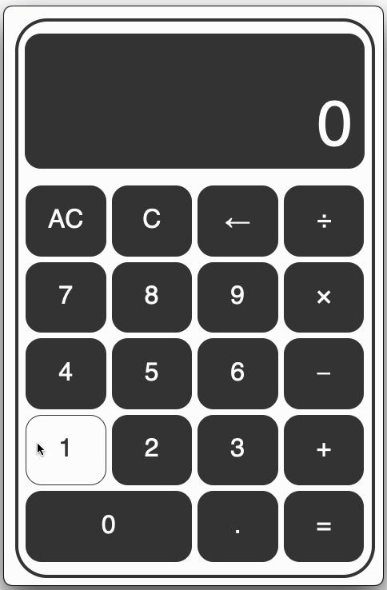

# Calculator!
A live implementation of the project can be found at this [GitHub Pages link](https://emannuelmartineztest.github.io/calculator/).

## Initial Goals
We were supposed to implement a calculator that had the following functions:
- Binary Operations (Addition, Subtraction, Multiplication, Division)
- Binary Computations
  - i.e., each operator signified a new computation, instead of waiting for the whole expression and performing PEMDAS.
  - e.g., 12 + 7 - 5 * 3 = 42
    - Meaning it's computed as (((12 + 7) - 5) * 3) = 42, instead of (12 + 7) - (5 * 3) = 4

And that's really it. 

### Personal Objectives
I wanted to finally use `typescript` in a project, and figured that a calculator was as good a time as any!
It definitely could have been used more robustly, but I'll get the hang of it in time. 

We also added keyboard support and made sure the decimal wasn't selected twice once it already was in the input.